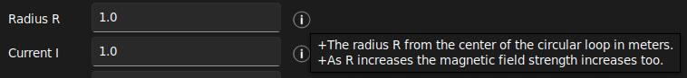

# tkinter-tooltip

## What this is

This is a simple yet fully customisable tooltip/pop-up implementation for
`tkinter` widgets. It is capable of fully integrating with custom `tkinter`
themes both light and dark ones.



## Features

- normal tooltips
- show tooltip with `s` seconds `delay`
- tooltip tracks mouse cursor
- tooltip displays strings and string returning functions
- fully customisable, tooltip inherits underlying theme style

## Install

```shell
pip install tkinter-tooltip
```

## Examples

### Normal tooltips

By default the tooltip activates when entering and/or moving in the widget are
and deactivates when leaving and/or pressing any button.


```python
import tkinter as tk
import tkinter.ttk as ttk
from tktooltip import ToolTip

app = tk.Tk()
b = ttk.Button(app, text="Button").pack()
ToolTip(b, msg="Hover info")
app.mainloop()
```

### Delayed tooltip


```python
import tkinter as tk
import tkinter.ttk as ttk
from tktooltip import ToolTip

app = tk.Tk()
b = ttk.Button(app, text="Button")
b.pack()
ToolTip(b, msg="Hover info", delay=2.0)   # True by default
app.mainloop()
```

### Tracking tooltip

Have the tooltip follow the mousse cursor around when moving.


```python
import tkinter as tk
import tkinter.ttk as ttk
from tktooltip import ToolTip

app = tk.Tk()
b = ttk.Button(app, text="Button")
b.pack()
ToolTip(b, msg="Hover info", follow=True)   # True by default
app.mainloop()
```

### Function as tooltip

Here the tooltip returns the value of `time.asctime()` which updates with every
movement. NOTE: the values do not update when the cursor is stationary.


```python
import time
import tkinter as tk
import tkinter.ttk as ttk
from tktooltip import ToolTip

app = tk.Tk()
b = ttk.Button(app, text="Button")
b.pack()
ToolTip(b, msg=time.asctime(), delay=0)
app.mainloop()
```

### Themed tooltip

`tkinter-tooltip` is fully aware of the underlying theme (in this case a dark theme),
and can even be furher customised by passing `tk` styling arguments to the tooltip


Style tooltip and underlying the button. If a full theme has been used then
the `ToolTip` will inherit the settings of the theme by default.

```python
import tkinter as tk
import tkinter.ttk as ttk
from tktooltip import ToolTip

app = tk.Tk()
s = ttk.Style()
s.configure("custom.TButton", foreground="#ffffff", background="#1c1c1c")
b = ttk.Button(app, text="Button", style="custom.TButton")
b.pack()
ToolTip(b, msg="Hover info", delay=0,
        parent_kwargs={"bg": "black", "padx": 5, "pady": 5},
        fg="#ffffff", bg="#1c1c1c", padx=10, pady=10)
app.mainloop()
```

## Acknowledgements

`tkinter-tooltip` is based on the original work performed by
[Tucker Beck](http://code.activestate.com/recipes/576688-tooltip-for-tkinter/)
licensed under an MIT License.

## License

MIT License
